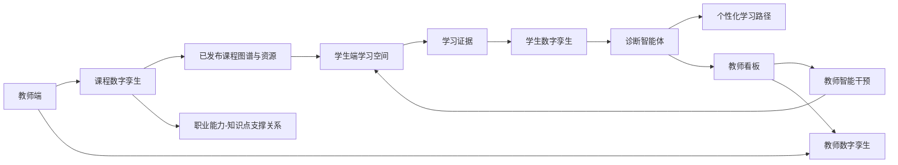

# AI-Education 系统详细设计说明书（开发基线版）

生成时间：2026-06-28 13:30:22

## 1. 当前结论

当前 zyh 分支已经按需求文档落地了部分主链路能力，但还没有达到完整产品态。已跑通的部分主要集中在课程数字孪生建设、职业能力映射、学生画像、诊断报告、个性化路径和作业/测验证据回流；教师数字孪生、教师干预、5E 有效性、学生学习空间和在线测验完整业务页仍需要继续按本设计补齐。

当前代码连接的是本地 MySQL 数据库 `ai_education_design`，数据库共有 `42` 张表。其中 `30` 张表已有 smoke/demo 验证数据，`12` 张表目前只有结构没有业务数据。

## 2. 需求对齐状态

| 模块 | 需求文档目标 | 当前实现状态 | 后续处理 |
|---|---|---|---|
| 课程数字孪生与课程资源 | 教师建设课程结构，系统生成课程图谱，自动绑定外部资源，教师配置岗位并审核职业能力-知识点支撑关系，课程运行后形成课程健康评估。 | 部分实现。结构保存、资源表、发布、岗位、能力、映射、运行评估已可跑；运行评估已读取资源学习事件和作业覆盖知识点配置；外部资源真实自动检索、本地资料 RAG 入库、能力缺口补知识点仍不完整。 | 继续补齐资源自动绑定、资料入库、能力缺口工作流和教师端页面。 |
| 学生数字孪生 | 汇总测验、作业、代码题、资源学习、5E 交互证据，形成知识点掌握、章节综合实践能力、职业能力达成和学生端/教师端不同视图。 | 部分实现。已有画像总表、知识点画像、掌握度公式和画像摘要；章节综合实践能力、职业能力达成展示、资源学习证据仍待补齐。 | 先补证据表和计算，再补前端画像视图。 |
| 诊断智能体 | 服务学生数字孪生、个性化路径和教师看板，输出薄弱点、原因、证据等级、置信度、教师下钻证据和建议动作。 | 部分实现。规则诊断服务、诊断报告落库、证据等级、置信度、证据时间线已实现；教师人工修正记录已落库；教师看板批量诊断还需要继续对齐统一诊断服务。 | 把教师看板改为读取统一诊断服务，并完善修正后的再诊断展示。 |
| 个性化学习路径 | 根据诊断结果和课程图谱给学生安排补学知识点、资源、小测入口和作业入口；图谱外内容只作为补充学习项。 | 部分实现。路径优先消费诊断结果，正式路径节点来自薄弱知识点；资源推荐可离线 smoke；路径节点状态表已建，任务入口、缺作业提示和完成回流仍需接业务代码。 | 实现正式路径节点状态写入、任务入口、缺作业提示和结果回流。 |
| 作业与实践评测 | 稳定支持主观题、客观题、选择题、代码题；章节作业默认作为章节综合实践证据，覆盖知识点为教师确认的可选配置。 | 部分实现。作业创建、提交、评分已跑通；覆盖知识点配置表、读取和更新接口已实现；章节综合实践能力还未完全接入学生画像。 | 下一步补章节综合实践能力计算和画像展示。 |
| 教师数字孪生 | 基于教师教学行为、资源建设、互动、评估、干预、数字能力任务形成六维画像，并支持证据下钻。 | 部分实现。后端六维计算服务已存在，但底层事件表多数为空，页面和下钻稳定性还需验证。 | 先补事件采集，再调教师画像公式和前端下钻。 |
| 教师智能干预 | 诊断智能体给出风险和建议，3.9 生成线上任务包草稿，教师审核后下发，学生完成后回流。 | 部分实现。任务包草稿生成、教师修改、下发、学生接受/作答/完成和教师评分已有基础链路，并同步写入干预任务包三张业务表；仍需补前端审核体验和正式回流到学生画像/教师看板。 | 完善教师审核页面、学生任务体验和干预完成后的画像/看板回流。 |
| 5E 教学智能体 | 按 5E 阶段提供学习引导，记录交互证据，形成有效性指标，但不替代测验和作业。 | 基础代码存在，数据库事件表为空；有效性指标尚未产品化。 | 先定义有效性指标和事件采集，再接入学生画像。 |

## 3. 总体技术设计

系统采用前后端分离结构。前端位于 `frontend/`，后端位于 `backend/`，根目录 `main.py` 作为后端启动入口，本地开发数据库使用 MySQL `ai_education_design`。后续开发以本地 MySQL 为唯一运行数据库，不再保留 SQLite 运行逻辑。

核心数据流为：教师建设课程底座和能力映射；学生在学习空间学习资源、完成测验和作业；学习证据回流学生数字孪生；诊断智能体解释薄弱点；个性化路径给学生安排补学；教师看板和教师数字孪生读取诊断、行为和干预结果。



## 4. 数据库设计基线

当前本地库：`ai_education_design`。表数：`42`。

| 业务域 | 表名 | 当前行数 | 用途 | 状态 |
|---|---:|---:|---|---|
| 用户、权限与运行状态 | users | 2 | 用户主表，保存学生、教师、管理员账号及登录标识。 | 已有验证数据 |
| 用户、权限与运行状态 | user_profiles | 0 | 用户扩展资料。 | 结构已建，暂无业务数据 |
| 用户、权限与运行状态 | teacher_student_links | 1 | 教师与学生的班级/教学关系。 | 已有验证数据 |
| 用户、权限与运行状态 | sessions | 3 | 登录会话与学习上下文。 | 已有验证数据 |
| 用户、权限与运行状态 | user_states | 2 | 运行态键值状态，当前也用于教师外部指标缓存。 | 已有验证数据 |
| 用户、权限与运行状态 | llm_logs | 1 | 大模型调用日志。 | 已有验证数据 |
| 用户、权限与运行状态 | user_activity_log | 1 | 用户日活、登录、学习等活动日志。 | 已有验证数据 |
| 课程数字孪生与资源 | courses | 1 | 课程数字孪生课程主表，含发布状态。 | 已有验证数据 |
| 课程数字孪生与资源 | course_metadata | 1 | 课程额外结构数据。 | 已有验证数据 |
| 课程数字孪生与资源 | course_nodes | 3 | 课程章节、小节、叶子知识点节点。 | 已有验证数据 |
| 课程数字孪生与资源 | course_node_relations | 0 | 课程节点关系扩展表，当前不使用前置关系作为主逻辑。 | 结构已建，暂无业务数据 |
| 课程数字孪生与资源 | resources | 3 | 课程资源表，保存本地资源和外部资源绑定及审核状态。 | 已有验证数据 |
| 课程数字孪生与资源 | resource_learning_events | 2 | 资源学习事件表，记录点击、阅读、观看、完成等学习行为。 | 已有验证数据 |
| 职业能力与行业对接 | career_positions | 1 | 课程目标岗位配置，区分主要岗位和关联岗位。 | 已有验证数据 |
| 职业能力与行业对接 | career_abilities | 1 | 岗位提取出的职业能力候选。 | 已有验证数据 |
| 职业能力与行业对接 | course_ability_mappings | 1 | 职业能力与叶子知识点的教师确认支撑关系。 | 已有验证数据 |
| 学生数字孪生、测验与诊断 | twin_profiles | 1 | 学生数字孪生总画像。 | 已有验证数据 |
| 学生数字孪生、测验与诊断 | twin_profile_nodes | 1 | 学生在知识点上的掌握、进度、时长和交互证据。 | 已有验证数据 |
| 学生数字孪生、测验与诊断 | twin_history | 1 | 学生画像历史快照。 | 已有验证数据 |
| 学生数字孪生、测验与诊断 | quiz_attempts | 24 | 在线测验作答证据。 | 已有验证数据 |
| 学生数字孪生、测验与诊断 | diagnosis_reports | 22 | 诊断智能体生成的学习诊断报告。 | 已有验证数据 |
| 学生数字孪生、测验与诊断 | diagnosis_corrections | 1 | 教师对诊断结论的人工修正记录。 | 已有验证数据 |
| 个性化学习路径 | learning_plans | 9 | 个性化学习路径版本主表。 | 已有验证数据 |
| 个性化学习路径 | learning_plan_nodes | 9 | 学习路径内容节点/载荷。 | 已有验证数据 |
| 个性化学习路径 | learning_path_node_status | 5 | 学生学习路径节点状态表，记录待学、进行中、完成和掌握度变化。 | 已有验证数据 |
| 作业与实践评测 | homework_assignments | 24 | 教师发布的作业，当前稳定支持主观题、客观题、选择题、代码题。 | 已有验证数据 |
| 作业与实践评测 | homework_submissions | 24 | 学生作业提交和评分结果。 | 已有验证数据 |
| 作业与实践评测 | homework_assignment_knowledge_points | 1 | 作业覆盖知识点配置表，支持系统推荐、教师确认。 | 已有验证数据 |
| 作业与实践评测 | homework_grading_events | 0 | 作业批改行为事件，用于教师数字孪生。 | 结构已建，暂无业务数据 |
| 教师数字孪生与教学行为 | teaching_announcements | 0 | 教学公告。 | 结构已建，暂无业务数据 |
| 教师数字孪生与教学行为 | teaching_discussion_topics | 0 | 教学讨论主题。 | 结构已建，暂无业务数据 |
| 教师数字孪生与教学行为 | teaching_discussion_posts | 0 | 教学讨论回复。 | 结构已建，暂无业务数据 |
| 教师数字孪生与教学行为 | teaching_research_records | 0 | 教研活动记录。 | 结构已建，暂无业务数据 |
| 教师数字孪生与教学行为 | teaching_interaction_events | 0 | 教师互动事件。 | 结构已建，暂无业务数据 |
| 教师数字孪生与教学行为 | teaching_research_events | 0 | 教研行为事件。 | 结构已建，暂无业务数据 |
| 教师数字孪生与教学行为 | teacher_intervention_events | 5 | 教师干预任务包相关事件。 | 已有验证数据 |
| 教师数字孪生与教学行为 | intervention_packages | 1 | 教师智能干预任务包主表。 | 已有验证数据 |
| 教师数字孪生与教学行为 | intervention_package_items | 11 | 干预任务包内的资源、测验、作业、提醒等任务项。 | 已有验证数据 |
| 教师数字孪生与教学行为 | intervention_package_student_records | 1 | 学生完成干预任务包和任务项的记录。 | 已有验证数据 |
| 5E 教学智能体 | events | 0 | 5E 智能体底层事件记录。 | 结构已建，暂无业务数据 |
| 5E 教学智能体 | user_interaction | 0 | 5E 或学习交互统计记录。 | 结构已建，暂无业务数据 |
| 5E 教学智能体 | fivee_effectiveness_records | 0 | 5E 引导有效性指标记录。 | 结构已建，暂无业务数据 |

### 4.1 当前已有数据

当前已有数据主要来自核心业务 smoke test，用于验证接口和数据库链路，不应视为正式演示数据。

| 数据类别 | 当前内容 |
|---|---|
| 用户 | 1 个教师账号 `smoke_teacher`，1 个学生账号 `smoke_student`。 |
| 课程 | 1 门 `Smoke 大数据课程`，已发布。 |
| 课程节点 | 3 个节点：章节、小节、叶子知识点 `Flume 基础`。 |
| 资源 | 3 条外部资源，分别模拟 B 站、YouTube、CSDN 资源，均为启用状态。 |
| 岗位与能力 | 1 个主要岗位 `Data Engineer`，1 个能力 `Data ingestion pipeline`，并绑定到叶子知识点。 |
| 学生画像 | 1 个学生画像，1 条知识点画像。 |
| 测验/作业 | 15 条测验作答、15 个作业、15 条作业提交，来自多次 smoke test。 |
| 诊断/路径 | 6 条诊断报告、3 条路径版本、3 条路径载荷。 |

### 4.2 表结构原则

课程图谱正式节点只来自 `course_nodes`；职业能力映射只允许绑定叶子知识点；图谱外大模型推荐内容只能作为补充学习项，不直接写入正式图谱；章节作业默认不拆分到所有叶子知识点，只有教师确认覆盖知识点后才作为知识点辅助证据。

## 5. 模块详细设计

### 5.1 课程数字孪生与课程资源

课程数字孪生从课程视角评价课程结构、资源、测评证据、运行薄弱点和职业能力支撑是否能支撑学生学习。建设阶段由教师录入课程、章节、小节和知识点，系统校验层级、名称和叶子节点，生成课程图谱；资源绑定阶段由系统按叶子知识点自动绑定外部资源，教师可启用、禁用、替换或补充；能力阶段由教师配置主要岗位和关联岗位，系统抽取职业能力并生成候选映射，教师确认后发布。

课程运行评估按五个角度输出：课程结构质量、资源覆盖与有效性、测评证据与学习效果、运行薄弱点、职业能力支撑。

关键公式：

```text
StructureScore = 100 * 完整叶子知识点数 / 叶子知识点总数
ResourceCoverage = 有效资源覆盖叶子知识点数 / 叶子知识点总数
AssessmentCoverage = 有效作答人数达标的叶子知识点数 / 叶子知识点总数
K_risk(k) = 0.50 * (1 - Mastery(k)/100) + 0.35 * (1 - QuizCorrect(k)/100) + 0.15 * StudyBurden(k)
A_sup(a) = sum(w(k,a) * Mastery(k)) / sum(w(k,a))
CourseHealth = 0.20*StructureScore + 0.20*ResourceScore + 0.20*AssessmentScore + 0.25*MasteryScore + 0.15*AbilityScore
```

当前已实现的运行评估接口为 `GET /api/course-digital-twin/{course_id}/runtime-evaluation`。该评估已经读取资源学习事件，输出资源触达率、完成率和平均进度；也会读取教师确认的作业覆盖知识点配置。重复访问、路径停滞和正式测验定义仍需继续补业务埋点。

### 5.2 学生数字孪生

学生数字孪生以学生为对象，聚合知识点掌握、学习进度、学习时长、测验、作业、代码题、资源学习和 5E 交互证据。学生端展示“哪里薄弱、为什么、下一步怎么学”，教师端展示更完整的证据和下钻入口。

当前知识点掌握度公式为：

```text
MasteryScore = 0.40*QuizScore + 0.30*Progress + 0.20*min(LLMInteractionCount/10, 1)*100 + 0.10*min(StudyDurationMinutes/30, 1)*100
OverallMastery = avg(MasteryScore)
```

后续需要补充章节综合实践能力：章节主观题和代码题作为章节综合实践证据；如果教师确认作业覆盖知识点，再作为对应叶子知识点的辅助证据。

### 5.3 诊断智能体

诊断智能体是学生数字孪生、个性化路径和教师看板之间的共用服务。它不直接替代课程数字孪生或教师数字孪生，而是解释学生学习薄弱点，并把证据等级、置信度、原因类型和建议动作标准化输出。

诊断输入包括学生画像节点、测验作答、作业/代码题提交、学习进度、学习时长和课程图谱上下文。诊断输出包括薄弱知识点、原因类型、证据等级、证据不足原因、置信度、学生端说明、教师端证据时间线和建议动作。

证据等级规则：

| 等级 | 判断逻辑 | 处理方式 |
|---|---|---|
| 依据充分 | 测验不少于 2 次，并且有作业评分、学习进度或学习时长中的至少一类证据。 | 可给出明确诊断。 |
| 依据一般 | 有测验、作业、进度或时长中的任一证据，但次数较少。 | 给出初步判断，并提示补充证据。 |
| 依据不足 | 未布置/未采集、已布置但学生未完成、样本太少或证据过旧。 | 不给强诊断，只提示补测验、补作业或完成学习任务。 |

置信度公式：

```text
Confidence = min(100, QuizEvidence*35 + HomeworkEvidence*25 + ProfileProgress*15 + StudyDuration*10 + RecentEvidence*15)
QuizEvidence = min(测验次数, 2) / 2
HomeworkEvidence = min(已评分作业数, 1)
ProfileProgress = 1 if progress > 0 else 0
StudyDuration = 1 if study_duration_minutes > 0 else 0
RecentEvidence = 1 if latest_evidence_days <= 30 else 0
```

### 5.4 个性化学习路径

个性化学习路径根据诊断智能体识别出的薄弱知识点生成下一步学习安排。正式路径节点必须来自已发布课程图谱；大模型或外部资源推荐出的图谱外概念，只能进入补充学习项，不能直接混入正式课程路径。

路径节点包含学习顺序、知识点、掌握度、证据等级、建议动作、学习资源、小测入口和已发布作业入口。若缺少合适作业或代码练习，系统只向教师端提示补充或生成草稿，不自动发布给学生。

### 5.5 教师数字孪生

教师数字孪生关注教师教学支持行为是否有效，不等同于课程数字孪生。课程数字孪生看课程、知识点、资源和能力映射是否健康；教师数字孪生看教师是否及时查看学情、发布资源、互动答疑、批改反馈和实施干预。

当前六维指标设计如下：

| 维度 | 核心数据 | 计算口径 |
|---|---|---|
| 专业投入 | 在线时长、登录频次、教研协作、进阶功能使用 | 0.35*在线活跃 + 0.25*登录频次 + 0.20*教研协作 + 0.20*功能探索 |
| 数字资源 | 资源格式数、资源迭代次数、共享复用 | 0.40*资源多样性 + 0.35*迭代频次 + 0.25*共享复用 |
| 教学与学习 | 公告、讨论、回复、发布节奏、AI 建议执行 | 0.45*互动频率 + 0.30*节奏控制 + 0.25*人机协作 |
| 评估 | 评价类型、反馈长度、批改耗时、补救动作 | 0.40*评价多样性 + 0.35*反馈及时深度 + 0.25*数据驱动调整 |
| 赋能学习者 | 个性化推送、风险学生干预、非强制参与 | 0.40*个性化下发率 + 0.35*风险干预覆盖 + 0.25*学生主动反馈 |
| 促进学习者数字能力 | 数字任务、协作任务、探究任务 | 0.40*数字任务比例 + 0.30*协作任务比例 + 0.30*探究学习比例 |

教师数字孪生不由诊断智能体直接诊断；它读取教师行为事件和学生学习结果，形成教师画像。诊断智能体可以给教师看板提供风险学生与证据，但教师画像的核心仍是教师行为数据。

### 5.6 教师智能干预与 5E

教师智能干预接收诊断智能体输出的风险学生、薄弱知识点、证据等级和建议动作，生成学生端线上任务包草稿。任务包必须经教师审核、修改、确认后下发。学生完成后，结果回流学生画像、教师看板和教师数字孪生。

5E 教学智能体按学习阶段提供引导和问答，记录阶段、问题类型、互动次数、错误情况和学习上下文。5E 有效性不直接替代测验或作业，建议先用完成度、有效互动率、后续测验提升和路径继续学习率四类指标评估。

## 6. 接口边界

| 接口 | 归属 | 设计状态 |
|---|---|---|
| `GET /api/course-digital-twin/courses` | 课程数字孪生 | 已实现 |
| `POST /api/course-digital-twin/initial-graph` | 课程数字孪生 | 已实现基础版，按教师大纲生成初始图谱 |
| `POST /api/course-digital-twin/structure` | 课程数字孪生 | 已实现 |
| `POST /api/course-digital-twin/resource-candidates/bind` | 课程数字孪生 | 已实现基础版，候选资源生成与审核入库 |
| `GET /api/course-digital-twin/{course_id}/runtime-evaluation` | 课程数字孪生 | 已实现，指标需继续补埋点 |
| `POST /api/course-digital-twin/positions` | 课程数字孪生/行业能力 | 已实现 |
| `POST /api/course-digital-twin/abilities/import` | 课程数字孪生/行业能力 | 已实现 |
| `POST /api/course-digital-twin/ability-mappings` | 课程数字孪生/行业能力 | 已实现 |
| `POST /api/digital-twin/diagnosis/{username}` | 诊断智能体 | 已实现 |
| `POST /api/digital-twin/path/generate/{username}` | 个性化学习路径 | 已实现基础版 |
| `GET /api/digital-twin/student-profile/{username}` | 学生数字孪生 | 已实现基础版 |
| `GET /api/digital-twin/teacher-profile/{teacher_username}` | 教师数字孪生 | 已实现基础版，事件数据不足 |
| `POST /api/homework/assignments` | 作业与实践评测 | 已实现基础版 |
| `POST /api/intervention/teacher/generate-draft` | 教师智能干预 | 已实现基础版并同步落库 |
| `POST /api/5e/chat/message` | 5E 教学智能体 | 基础代码存在，需补有效性回流 |

## 7. 开发顺序

1. 先冻结本详细设计作为 zyh 分支开发基线。
2. 作业覆盖知识点、资源学习事件、路径节点状态、诊断人工修正、干预任务包已接入基础业务链路；下一步继续补章节综合实践能力、教师看板统一诊断读取、干预回流和 5E 有效性事件。
3. 完成课程数字孪生建设与运行评估页面，确保教师能建设课程、审核资源、审核能力映射、查看课程健康。
4. 完成学生数字孪生与诊断服务联动，保证学生端和教师端展示边界不同。
5. 完成个性化路径节点、任务入口、完成回流。
6. 完善教师智能干预前端审核体验，并把任务完成结果回流学生画像、教师看板和教师数字孪生。
7. 补教师数字孪生事件采集和 5E 有效性指标。
8. 每完成一轮开发，同步更新需求文档、概要设计、详细设计、接口说明和数据库 schema。

## 8. 当前风险

| 风险 | 影响 | 处理方式 |
|---|---|---|
| 需求文档描述比当前系统更完整 | 直接按需求验收会发现多个模块缺页、缺事件、缺回流 | 在本设计中标注状态，按主链路逐步补齐 |
| 数据库已有表但数据为空 | 教师数字孪生、5E、干预无法真实计算 | 先补事件采集，再谈指标展示 |
| smoke 数据重复 | 当前表里作业、测验、诊断有多次验证数据 | 后续单独准备演示数据和清库脚本 |
| 资源自动检索与质量过滤未完整产品化 | 课程资源绑定无法完全符合需求 | 先用已有资源推荐能力接入课程建设流程，再补教师审核 |
| 作业覆盖知识点业务未接入 | 章节作业暂时无法辅助影响叶子知识点 | 表结构已建立，下一步接系统推荐和教师确认流程 |

