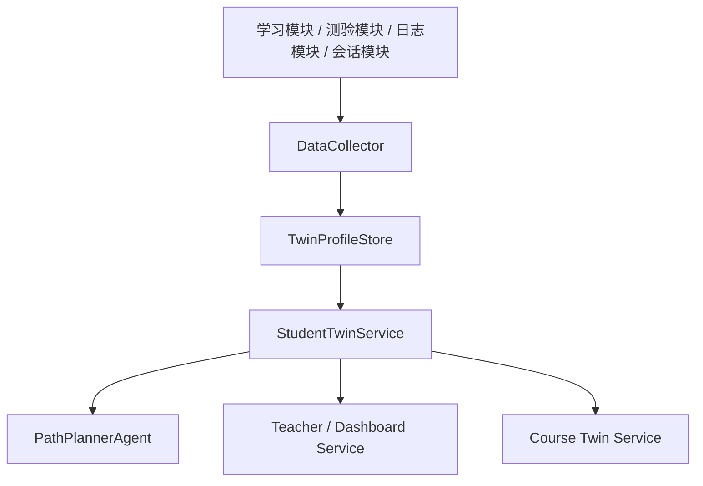

# 后端模块 Python 接口清单

## 1. 目标
本文档说明在“一个统一的大后端”前提下，模块之间建议如何通过 Python 函数协同，而不是互相调用 Web API。

原则：

- 前端访问后端：走统一 HTTP API
- 后端模块之间：优先走 Python Service / 函数调用

---

## 2. 学生孪生相关接口

### 2.1 数据采集层

模块：`DigitalTwinModule.data_collector.DataCollector`

| 函数 | 作用 |
|---|---|
| `collect_all(username)` | 一次性采集学习进度、互动记录、会话时长并刷新学生孪生 |
| `collect_progress(username)` | 采集学习进度 |
| `collect_llm_interactions(username)` | 采集 LLM 互动记录 |
| `collect_session_duration(username)` | 采集会话时长 |
| `collect_quiz_score(username, node_id, score)` | 回写测验成绩 |

### 2.2 学生孪生服务层

模块：`DigitalTwinModule.student_twin_service.StudentTwinService`

| 函数 | 作用 |
|---|---|
| `build_summary(profile, trend)` | 构建学生孪生摘要，输出技术分层、雷达图、风险、趋势、薄弱点 |

### 2.3 存储层

模块：`DigitalTwinModule.twin_profile_store.TwinProfileStore`

| 函数 | 作用 |
|---|---|
| `load(username)` | 读取学生孪生快照 |
| `load_or_create(username)` | 读取或初始化学生孪生快照 |
| `save(profile)` | 保存学生孪生快照 |
| `exists(username)` | 判断快照是否存在 |

### 2.4 趋势层

模块：`DigitalTwinModule.trend_tracker.TrendTracker`

| 函数 | 作用 |
|---|---|
| `record_daily_snapshot(username, overall_mastery)` | 记录每日掌握度快照 |
| `get_trend(username, days)` | 获取一段时间内趋势数据 |

---

## 3. 学习路径相关接口

模块：`PathPlannerModule.path_planner_agent.PathPlannerAgent`

| 函数 | 作用 |
|---|---|
| `plan(username)` | 基于学生孪生生成个性化学习路径 |
| `update_path_on_mastery_change(username, node_id, new_score)` | 学生掌握度变化后更新路径 |

---

## 4. 教师端 / Dashboard 相关接口

模块：`DashboardModule.dashboard_api`

当前这部分对前端暴露为 API，但内部聚合逻辑本质上可沉到 service 层。建议后续抽成 Python service 的函数包括：

| 建议函数 | 作用 |
|---|---|
| `get_class_overview_data()` | 获取班级概览 |
| `get_student_detail(username)` | 获取指定学生完整画像与薄弱点 |
| `get_student_trend(username, days)` | 获取学生趋势 |
| `get_node_ranking(node_id)` | 获取知识点班级排名 |

---

## 5. 课程模块建议暴露的 Python 接口

当前学生孪生和路径规划已经依赖课程树。建议课程模块统一暴露：

| 建议函数 | 作用 |
|---|---|
| `get_course_tree()` | 获取完整课程树 |
| `get_all_leaf_nodes()` | 获取所有叶子知识点 |
| `resolve_node_path(node_id)` | 根据知识点 ID 解析路径 |
| `get_node_resources(node_id)` | 获取知识点资源 |

---

## 6. 测验模块建议暴露的 Python 接口

| 建议函数 | 作用 |
|---|---|
| `prepare_quiz_questions(subject, language, retriever, username)` | 生成测验题目 |
| `record_quiz_result(username, node_id, score, total)` | 统一记录测验结果 |
| `generate_quiz_summary(topic, score, total, answers)` | 生成测验总结 |

---

## 7. 学习计划与总结模块建议暴露的 Python 接口

### 学习计划

| 建议函数 | 作用 |
|---|---|
| `generate_learning_plan(name, goals, lang_choice, priority, deadline_days)` | 生成通用学习计划 |
| `generate_learning_plan_from_quiz(name, state, lang_choice)` | 根据测验结果生成学习计划 |

### 总结模块

| 建议函数 | 作用 |
|---|---|
| `generate_summary(topic, lang_choice)` | 基于当前课程主题生成总结 |

---

## 8. 推荐的内部调用关系

