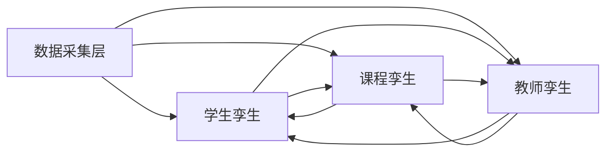

# 数字孪生指标体系总表

## 1. 目标
本文档用于统一三大数字孪生：

- 学生孪生
- 课程孪生
- 教师孪生

的输入、输出、核心指标与流转关系。

---

## 2. 三大数字孪生输入输出总表

| 数字孪生 | 输入来源 | 输入内容 | 输出内容 | 输出去向 |
|---|---|---|---|---|
| 学生孪生 | 数据采集层 | 学习行为、测验成绩、互动记录、代码/实践记录 | 能力雷达图、技术分层、发展预测、学习风险预警、薄弱知识点、学习路径 | 课程孪生、教师孪生 |
| 课程孪生 | 数据采集层、学生孪生、教师孪生 | 知识图谱、学生画像、教学策略、内容调整建议、资源使用效果 | 个性化学习路径、资源推荐、知识图谱补全、班级学习画像、知识点掌握分析、教学效果预测 | 学生孪生、教师孪生 |
| 教师孪生 | 数据采集层、学生孪生、课程孪生 | 教学行为、学生画像、课程反馈、班级学习画像、知识点掌握分析 | 教学策略建议、重难点定位、个性化指导建议、教学反思引导、干预策略、内容调整建议 | 学生孪生、课程孪生 |

---

## 3. 学生孪生指标

### 3.1 输入指标

| 指标 | 参数名 | 含义 |
|---|---|---|
| 学习进度 | `progress` | 学生在知识点上的完成度 |
| 测验成绩 | `quiz_score` | 学生在知识点上的测验得分 |
| 学习时长 | `study_duration_minutes` | 学生在知识点上的累计学习时长 |
| 互动次数 | `llm_interaction_count` | 学生围绕知识点与 AI 或系统的互动次数 |
| 节点路径 | `node_path` | 知识点在课程树中的路径 |

### 3.2 输出指标

| 指标 | 参数名 | 含义 |
|---|---|---|
| 整体掌握度 | `overall_mastery` | 所有知识点掌握度平均值 |
| 技术分层 | `technical_level` | 学生当前能力层级 |
| 能力雷达图 | `radar` | 五维能力评分 |
| 薄弱知识点 | `weak_nodes` | 掌握度低于阈值的知识点 |
| 风险预警 | `risk_alerts` | 当前识别出的学习风险 |
| 趋势分析 | `trend` | 近 30 天掌握度变化 |
| 个性化学习路径 | `learning_path` | 面向学生的学习顺序和资源推荐 |

### 3.3 学生孪生核心口径

| 指标 | 规则 |
|---|---|
| 掌握度 | `0.4×quiz + 0.3×progress + 0.2×互动归一化 + 0.1×时长归一化` |
| 技术分层 | 依据 `overall_mastery` 和薄弱点数量 |
| 风险预警 | 依据掌握度、进度、投入、趋势和薄弱点数量 |
| 趋势状态 | 依据 30 天整体掌握度变化值 |

---

## 4. 课程孪生指标

### 4.1 当前已具备基础的输入

| 输入 | 说明 |
|---|---|
| 知识图谱 / 课程树 | 来自课程结构 JSON 和 Neo4j |
| 学生整体掌握度 | 来自学生孪生 |
| 学生薄弱知识点 | 来自学生孪生 |
| 学习路径结果 | 来自路径规划模块 |
| 资源信息 | 来自课程资源挂接 |

### 4.2 建议统一的课程孪生输出指标

| 指标 | 中文说明 |
|---|---|
| `class_learning_profile` | 班级整体学习画像 |
| `node_mastery_distribution` | 各知识点掌握率分布 |
| `resource_effectiveness` | 资源使用率与效果评估 |
| `content_gap_nodes` | 需要补资源或补图谱的知识点 |
| `path_recommendation_summary` | 推荐学习路径汇总 |
| `course_heatmap` | 知识点热度/难度热力图 |

### 4.3 课程孪生建议计算口径

| 指标 | 建议逻辑 |
|---|---|
| 班级学习画像 | 汇总学生整体掌握度、投入度、趋势状态 |
| 知识点掌握分析 | 汇总同一 `node_id` 的平均掌握度 |
| 资源使用分析 | 资源被点击、学习、完成、关联提升效果 |
| 教学效果预测 | 基于班级掌握趋势、薄弱点聚集情况进行预测 |

---

## 5. 教师孪生指标

### 5.1 当前已具备基础的输入

| 输入 | 说明 |
|---|---|
| 学生孪生摘要 | 学生掌握度、分层、风险、薄弱点 |
| 班级概览 | 当前教师端已提供班级平均掌握度等信息 |
| 课程资源结构 | 当前教师端已支持课程资源管理 |
| 课程知识点分析 | 来自 dashboard / heatmap |

### 5.2 建议统一的教师孪生输出指标

| 指标 | 中文说明 |
|---|---|
| `teaching_strategy_advice` | 教学策略建议 |
| `key_difficulty_nodes` | 班级重难点知识点 |
| `student_intervention_queue` | 需要优先干预的学生列表 |
| `teaching_reflection_hints` | 教学反思建议 |
| `resource_adjustment_advice` | 资源调整建议 |
| `class_risk_overview` | 班级风险总览 |

### 5.3 教师孪生建议计算口径

| 指标 | 建议逻辑 |
|---|---|
| 教学重难点定位 | 低掌握度知识点 + 高薄弱点聚集度 |
| 干预优先级 | 学生高风险 + 趋势下降 + 薄弱点集中 |
| 教学策略建议 | 结合班级分层结构和课程重难点生成 |
| 教学反思引导 | 结合资源使用、班级波动、测验反馈生成 |

---

## 6. 当前成熟度判断

| 数字孪生 | 当前成熟度 | 说明 |
|---|---|---|
| 学生孪生 | 高 | 已有完整采集、计算、展示链路 |
| 课程孪生 | 中 | 有课程树和资源结构基础，但指标还需继续落地 |
| 教师孪生 | 中 | 已有班级概览和学生联动，但策略类指标仍待补强 |

---

## 7. 模块间流转关系

