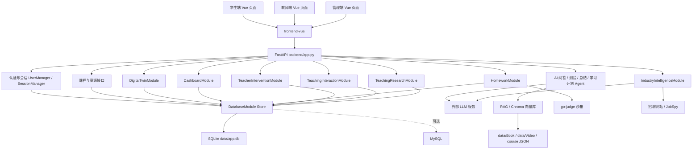
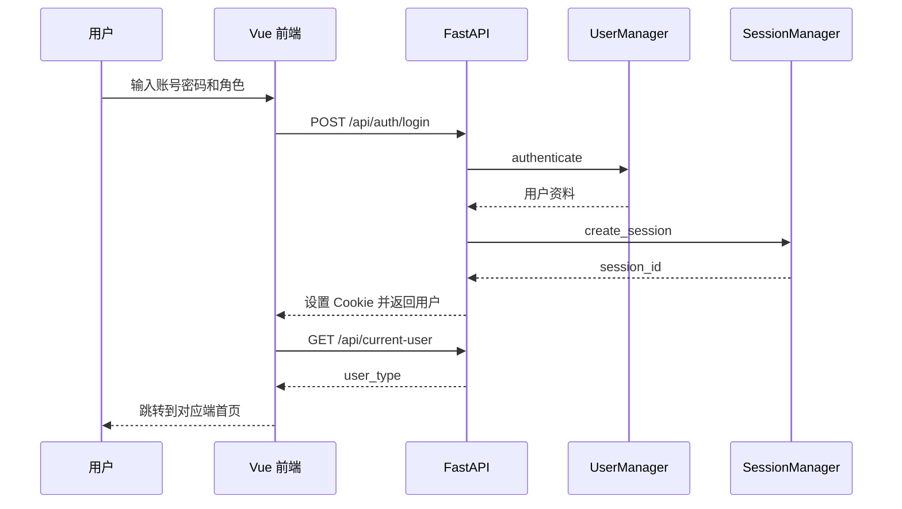
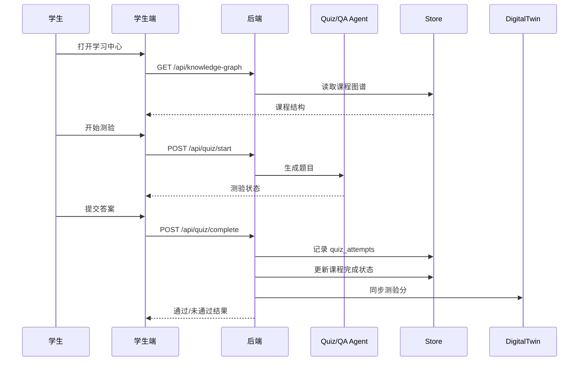
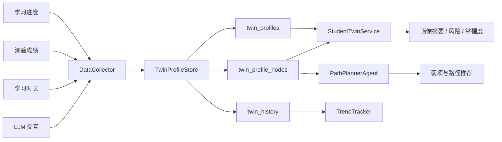
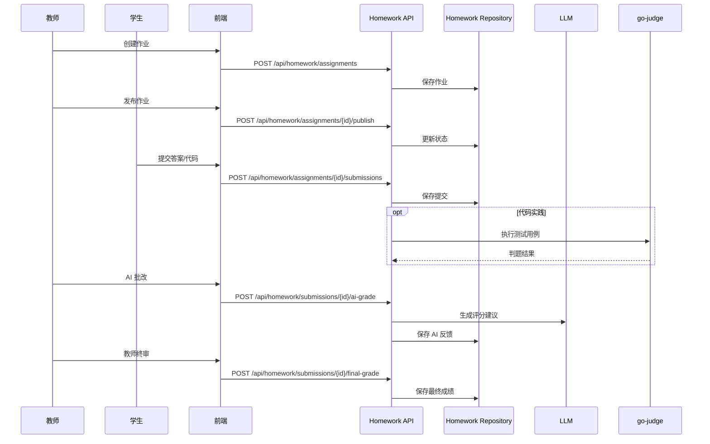
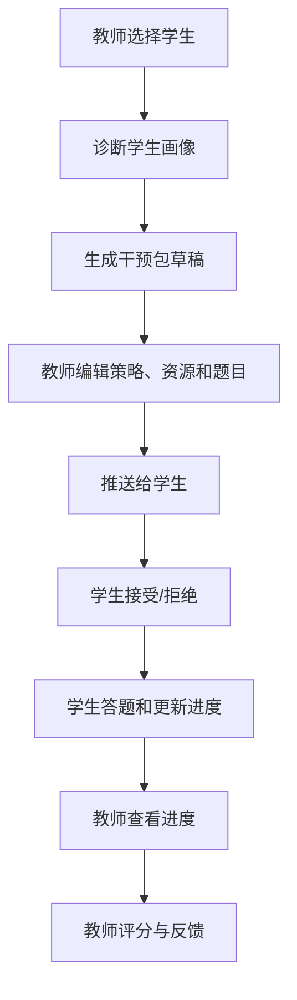
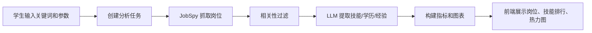

# AI-Education 设计文档

> 版本：v1.0  
> 编写日期：2026-05-13  
> 适用范围：当前仓库 `AI-Education2` 的系统架构、模块设计、数据设计、接口设计和部署运维设计。

## 1. 设计目标

本系统以“课程学习闭环 + 学生/教师数字孪生 + AI 辅助教学”为核心。设计目标如下：

1. 前后端分离，前端使用 Vue 3，后端使用 FastAPI。
2. 后端按业务域模块化，降低学生端、教师端、管理端之间的耦合。
3. 统一身份、会话、数据库访问、LLM 日志、RAG 和资源管理能力。
4. 数据存储以实体表为主，历史 JSON 作为兼容和迁移来源。
5. 支持 SQLite 本地开发和 MySQL 扩展部署。
6. 支持 LLM、RAG、OJ 判题、岗位抓取等外部能力可配置接入。

## 2. 总体架构



## 3. 技术栈

| 层级 | 技术 |
| --- | --- |
| 前端 | Vue 3、Vite、TypeScript、Vue Router、Element Plus、ECharts、vue-i18n、axios |
| 后端 | Python、FastAPI、Pydantic、Uvicorn |
| 数据库 | SQLite 默认，MySQL 可选 |
| AI 能力 | LangChain OpenAI 兼容接口、RAG、OCR、LLM 日志 |
| 向量检索 | Chroma 本地向量库 |
| 判题 | go-judge Docker 沙箱 |
| 测试 | pytest、后端接口自测脚本、前端 `vue-tsc + vite build` |

## 4. 目录与模块

| 目录 | 职责 |
| --- | --- |
| `backend/` | FastAPI 应用入口、统一 API、静态资源托管、SPA 回退 |
| `frontend-vue/` | Vue 3 前端，包含学生、教师、管理员视图 |
| `DatabaseModule/` | 数据访问层、SQLite/MySQL Store、迁移工具 |
| `DigitalTwinModule/` | 学生/教师数字孪生、画像、趋势、事件、课程画像 |
| `DashboardModule/` | 教师看板、班级概览、学生详情、热力图 |
| `HomeworkModule/` | 作业、提交、AI 批改、题目生成、OJ 判题 |
| `TeacherInterventionModule/` | AI 干预任务包、学生响应、教师评分 |
| `TeachingInteractionModule/` | 公告、讨论、帖子、互动统计 |
| `TeachingResearchModule/` | 教研记录与教师事件沉淀 |
| `IndustryIntelligenceModule/` | 岗位抓取、相关性过滤、技能分析、图表数据 |
| `AgentModule/` | AI 问答 Agent |
| `QuizModule/` | 测验 Agent 与测验操作 |
| `SummaryModule/` | 章节总结 Agent |
| `LearningPlanModule/` | 学习计划生成 |
| `PathPlannerModule/` | 弱项检测、资源推荐、路径规划 |
| `KnowledgeGraph/` | 知识图谱构建与资源匹配流水线 |
| `go-judge-sandbox/` | Docker 判题沙箱配置 |
| `docs/` | 接口、数据库、模块、验收与对接文档 |
| `data/` | 课程、用户、PDF、视频、向量库和运行数据 |
| `release/` | 发布用数据库和初始化种子 |

## 5. 后端设计

### 5.1 应用入口

后端入口为 `backend/app.py`，启动入口为 `main.py`。

主要职责：

- 创建 FastAPI 应用。
- 注册 CORS、GZip 等中间件。
- 注册业务路由：看板、数字孪生、行业情报、作业、教学互动、教研、干预。
- 托管静态资源与前端构建产物。
- 提供 SPA 路由回退。
- 初始化日志、RAG 预热、后台画像采集任务。
- 提供登录、课程、测验、问答、总结、计划、资源等基础接口。

### 5.2 路由组织

| 模块 | 路由前缀 | 说明 |
| --- | --- | --- |
| 基础接口 | `/api/*` | 登录、课程、测验、问答、总结、学习计划、资源、OCR |
| 数字孪生 | `/api/digital-twin` | 学生画像、教师画像、路径、课程画像、事件 |
| 教师看板 | `/api/dashboard` | 班级概览、学生详情、趋势、节点排名、教师画像 |
| 作业 | `/api/homework` | 作业、提交、批改、出题、导出 |
| AI 干预 | `/api/intervention` | 教师干预包和学生干预包流程 |
| 教学互动 | `/api/teaching-interaction` | 公告、讨论、帖子、互动统计 |
| 教研协同 | `/api/teaching-research` | 教研记录和上下文选项 |
| 行业情报 | `/api/industry-intelligence` | 任务状态、分析、重分析、取消 |

### 5.3 会话与权限

当前系统使用 Cookie 会话：

- 登录成功后创建 `session_id`。
- `session_id` 保存于 HttpOnly Cookie。
- 后端通过 `SessionManager` 解析当前用户。
- 前端路由通过 `fetchCurrentUser()` 获取用户角色，控制学生、教师、管理员入口。

权限控制原则：

- 未登录访问受保护接口返回 401 或前端跳转登录。
- 学生只能查看和修改自己的学习数据、作业提交、干预包。
- 教师只能管理自己创建或关联的作业、互动、教研、干预资源。
- 管理员可查看平台级用户和日志数据。

### 5.4 数据访问层

`DatabaseModule.database_factory.DatabaseFactory` 根据环境变量创建数据库 Store：

- 默认：`SQLiteStore(db_path="data/app.db")`
- 可选：`MySQLStore`

设计要点：

- 业务层尽量通过 Store 方法访问数据。
- 表结构初始化和索引创建由 Store 负责。
- 历史 JSON 迁移通过迁移脚本或启动阶段兜底处理。
- 对外业务代码不直接依赖具体数据库类型。

### 5.5 Agent 与 LLM

系统包含多个 Agent：

- `QA_Agent`：课程问答。
- `Quiz_Agent`：测验生成与答题。
- `Summary_Agent`：章节总结。
- `Plan_Agent`：学习计划。
- `Coordinator_Agent`：协调类智能体能力。
- 行业情报 `SkillAnalyzer`：岗位技能抽取。

LLM 配置来自 `.env`：

- `model_name`
- `base_url`
- `api_key`
- `embedding_model`

后端采用懒加载策略初始化 Agent，避免启动时阻塞。

### 5.6 RAG 与资源处理

RAG 相关能力由 `tools/rag_service.py`、`tools/rag_utils.py` 等工具提供。

资源流转：

1. 教师或系统上传资源。
2. 后端将资源同步到课程实体表。
3. 对可检索资源触发 RAG 入库。
4. 学生问答时检索相关上下文。
5. LLM 基于问题、历史和检索上下文生成回答。

### 5.7 后台任务

系统启动后会创建数字孪生定时采集任务：

- 周期：约 10 分钟。
- 对已有画像用户执行 `DataCollector.collect_all()`。
- 采集失败时记录 warning，不中断主服务。

## 6. 前端设计

### 6.1 应用结构

前端入口：

- `frontend-vue/src/main.ts`
- `frontend-vue/src/App.vue`
- `frontend-vue/src/router/index.ts`

布局：

- `StudentLayout.vue`
- `TeacherLayout.vue`
- `AdminLayout.vue`

### 6.2 路由设计

学生端路由：

- `/student/home`
- `/student/learning`
- `/student/profile`
- `/student/course-content`
- `/student/student-twin`
- `/student/quiz`
- `/student/industry-intelligence`
- `/student/homework`
- `/student/homework/:assignmentId`
- `/student/intervention`
- `/student/intervention/:packageId`
- `/student/interaction`

教师端路由：

- `/teacher/dashboard`
- `/teacher/homework`
- `/teacher/homework/new`
- `/teacher/homework/:assignmentId/edit`
- `/teacher/homework/:assignmentId/submissions`
- `/teacher/homework/submissions/:submissionId/grade`
- `/teacher/intervention`
- `/teacher/intervention/:packageId`
- `/teacher/interaction`
- `/teacher/research`
- `/teacher/teacher-twin/drilldown`

管理端路由：

- `/admin/dashboard`

### 6.3 API 封装

前端按业务域封装 API：

| 文件 | 职责 |
| --- | --- |
| `api/client.ts` | 通用请求、课程问答、测验、总结、PDF、语言 |
| `api/login.ts` | 登录、退出、当前用户 |
| `api/student.ts` | 学习进度、学习计划、学生画像、路径 |
| `api/studentTwin.ts` | 管理端与测验相关兼容 API |
| `api/teacher.ts` | 教师看板、热力图、教师画像、资源上传删除 |
| `api/homework.ts` | 作业、提交、批改、AI 出题 |
| `api/intervention.ts` | AI 干预任务包 |
| `api/teaching.ts` | 教学互动与教研协同 |
| `api/industry.ts` | 行业情报任务 |
| `api/notification.ts` | 通知 |
| `api/learningStreak.ts` | 连续学习与活动 |

### 6.4 国际化

前端使用 `vue-i18n`，语言资源位于：

- `frontend-vue/src/locale/zh`
- `frontend-vue/src/locale/en`

当前主要页面已有中文和英文资源结构，部分旧文本仍存在编码显示问题，建议后续统一修复为 UTF-8。

## 7. 数据库设计

### 7.1 核心实体

| 表 | 主键 | 说明 |
| --- | --- | --- |
| `users` | `user_id` | 用户、登录标识、角色、资料 JSON |
| `teacher_student_links` | `teacher_username + student_username` | 教师学生关系 |
| `sessions` | `session_id` | 登录会话、当前 PDF、当前节点 |
| `courses` | `course_id` | 课程图谱 payload |
| `course_nodes` | `course_id + node_id` | 课程节点实体 |
| `resources` | `resource_id` | 节点资源 |
| `quiz_attempts` | `attempt_id` | 测验尝试记录 |
| `learning_plans` | `username + filename` | 学习计划 |
| `twin_profiles` | `username` | 学生画像摘要 |
| `twin_profile_nodes` | `username + node_id` | 学生画像节点 |
| `twin_history` | `username + snapshot_date` | 学生画像历史趋势 |
| `llm_logs` | `id` | LLM 调用日志 |
| `user_states` | `username` | 用户状态扩展 |

### 7.2 实体化策略

课程相关读写策略：

- 课程图谱读取：优先 `courses.payload_json`。
- 学习节点读取：优先 `course_nodes`。
- 节点资源读取：优先 `resources`。
- 资源上传/删除：实体表主写，并同步课程 payload。
- 测验完成：写入 `quiz_attempts`，同步课程 payload 和数字孪生。

历史兼容：

- `data/course/big_data.json` 继续作为课程来源和兜底数据。
- `data/user_data/*` 保留历史用户课程图谱。
- 迁移完成后应逐步移除运行时 JSON 主写路径。

### 7.3 索引设计

关键索引：

- 用户：`idx_users_user_id`、`idx_users_login_id`、`idx_users_type`
- 教师学生关系：`idx_links_teacher_user_id`、`idx_links_student_user_id`
- 画像：`idx_twin_profiles_user_id`、`idx_twin_nodes_user_id`、`idx_twin_nodes_username`
- 会话：`idx_sessions_username`、`idx_sessions_user_id`
- 日志：`idx_logs_username`、`idx_logs_timestamp`、`idx_llm_logs_user_id`
- 课程：`idx_course_nodes_course`
- 资源：`idx_resources_course_node`、`idx_resources_path`
- 测验：`idx_quiz_attempts_user_id`、`idx_quiz_attempts_course_id`、`idx_quiz_attempts_created_at`

## 8. 关键业务流程

### 8.1 登录流程



### 8.2 学习与测验流程



### 8.3 学生数字孪生流程



### 8.4 作业流程



### 8.5 AI 干预流程



### 8.6 行业情报流程



## 9. 接口设计摘要

### 9.1 基础接口

| 方法 | 路径 | 说明 |
| --- | --- | --- |
| `POST` | `/api/auth/login` | 统一登录 |
| `POST` | `/api/logout` | 退出登录 |
| `GET` | `/api/current-user` | 当前用户 |
| `POST` | `/api/update-profile` | 更新资料 |
| `POST` | `/api/change-password` | 修改密码 |
| `GET` | `/api/languages` | 支持语言 |
| `GET` | `/api/health/llm` | LLM 健康检查 |

### 9.2 学习接口

| 方法 | 路径 | 说明 |
| --- | --- | --- |
| `GET` | `/api/knowledge-graph` | 课程图谱 |
| `GET` | `/api/graph-visualization` | 图谱可视化 |
| `GET` | `/api/learning-nodes` | 学习节点 |
| `POST` | `/api/node/resources` | 节点资源 |
| `POST` | `/api/upload` | 上传资源 |
| `POST` | `/api/delete-resource` | 删除资源 |
| `GET` | `/api/recycle-bin` | 回收站 |
| `POST` | `/api/restore-resource` | 恢复资源 |
| `POST` | `/api/pdf/select` | 选择 PDF |
| `GET` | `/api/pdf/{path}` | 读取 PDF |
| `GET` | `/api/learning-progress` | 学习进度 |
| `GET` | `/api/learning-streak` | 连续学习 |
| `POST` | `/api/learning-activity` | 记录学习活动 |

### 9.3 AI 学习接口

| 方法 | 路径 | 说明 |
| --- | --- | --- |
| `POST` | `/api/chat` | 课程问答 |
| `POST` | `/api/summary` | 章节总结 |
| `POST` | `/api/quiz/start` | 开始测验 |
| `POST` | `/api/quiz/answer` | 提交答案 |
| `POST` | `/api/quiz/complete` | 完成测验 |
| `POST` | `/api/quiz/summary` | 测验总结 |
| `POST` | `/api/learning-plan` | 生成学习计划 |
| `POST` | `/api/learning-plan/from-quiz` | 从测验生成学习计划 |

### 9.4 数字孪生接口

| 方法 | 路径 | 说明 |
| --- | --- | --- |
| `POST` | `/api/digital-twin/collect/{username}` | 采集画像 |
| `GET` | `/api/digital-twin/profile/{username}` | 学生画像 |
| `GET` | `/api/digital-twin/student-profile/{username}` | 学生画像兼容接口 |
| `POST` | `/api/digital-twin/quiz-score` | 写入测验分 |
| `POST` | `/api/digital-twin/path/generate/{username}` | 生成路径 |
| `GET` | `/api/digital-twin/path/{username}/current` | 当前路径 |
| `PATCH` | `/api/digital-twin/path/{username}/node/{node_id}` | 更新路径节点 |
| `GET` | `/api/digital-twin/teacher-profile/{teacher_username}` | 教师画像 |
| `POST` | `/api/digital-twin/student-course-profile` | 学生课程画像 |

### 9.5 教师与作业接口

| 方法 | 路径 | 说明 |
| --- | --- | --- |
| `GET` | `/api/dashboard/class-overview` | 班级概览 |
| `GET` | `/api/dashboard/student/{username}` | 学生详情 |
| `GET` | `/api/dashboard/student/{username}/trend` | 学生趋势 |
| `GET` | `/api/dashboard/node/{node_id}/ranking` | 节点排名 |
| `GET` | `/api/dashboard/teacher-twin` | 教师画像 |
| `GET` | `/api/heatmap` | 知识点热力图 |
| `POST` | `/api/homework/assignments` | 创建作业 |
| `GET` | `/api/homework/assignments` | 作业列表 |
| `GET` | `/api/homework/assignments/{assignment_id}` | 作业详情 |
| `PUT` | `/api/homework/assignments/{assignment_id}` | 更新作业 |
| `POST` | `/api/homework/assignments/{assignment_id}/publish` | 发布作业 |
| `POST` | `/api/homework/assignments/{assignment_id}/submissions` | 学生提交 |
| `POST` | `/api/homework/submissions/{submission_id}/ai-grade` | AI 批改 |
| `POST` | `/api/homework/submissions/{submission_id}/final-grade` | 教师终审 |

## 10. 配置设计

### 10.1 `.env`

常用环境变量：

- `model_name`
- `base_url`
- `api_key`
- `embedding_model`
- `DB_TYPE`
- `DB_PATH`
- `DB_HOST`
- `DB_PORT`
- `DB_USER`
- `DB_PASSWORD`
- `DB_NAME`
- `CORS_ALLOW_ORIGINS`
- `CORS_ALLOW_ORIGIN_REGEX`

### 10.2 `config/app_runtime.json`

当前运行配置包含：

- `oj.run_url`
- `oj.timeout_seconds`
- `oj.java_bin`
- `cors.allow_origins`
- `cors.allow_origin_regex`

## 11. 安全设计

1. 登录态使用 `session_id` Cookie。
2. Cookie 设置 `httponly=True`。
3. 前端路由基于当前用户角色进行跳转。
4. 后端接口对关键资源执行角色和所有者校验。
5. 用户代码通过 go-judge 沙箱执行。
6. CORS 默认限制本地开发源，可通过配置调整。
7. LLM API Key 不应提交到版本库，应仅保存在 `.env` 或部署环境变量中。

## 12. 性能设计

1. 后端启用 GZip，压缩大于 1KB 的响应。
2. 课程数据使用内存缓存，默认 TTL 约 300 秒。
3. RAG 向量库启动预热，Agent 懒加载。
4. 行业情报支持多地区并发采集。
5. 课程、资源、测验、画像等关键查询建索引。
6. 前端使用 Vite 构建，路由页面按需动态导入。

## 13. 异常处理

| 场景 | 处理策略 |
| --- | --- |
| 未登录 | 返回 401 或前端跳转登录 |
| 无权限 | 返回 403 |
| 资源不存在 | 返回 404 |
| 参数错误 | 返回 400 或 Pydantic 校验错误 |
| LLM 初始化失败 | 记录 warning，相关接口返回明确失败 |
| RAG 预热失败 | 记录 warning，不阻塞服务启动 |
| OJ 判题失败 | 返回运行错误、超时或测试失败信息 |
| 行业采集不足 | 返回 warnings，并展示已获取结果 |

## 14. 部署与运行

### 14.1 后端

```powershell
pip install -r requirements.txt
python main.py
```

热重载：

```powershell
uvicorn backend.app:app --host 0.0.0.0 --port 8000 --reload
```

### 14.2 前端

```powershell
cd frontend-vue
npm install
npm run dev
```

生产构建：

```powershell
cd frontend-vue
npm run build
```

构建产物位于 `frontend-vue/dist`，后端会托管该目录并提供 SPA 回退。

### 14.3 OJ 沙箱

```powershell
cd go-judge-sandbox
docker compose up -d --build
```

运行地址默认：

```text
http://127.0.0.1:5050/run
```

## 15. 测试设计

### 15.1 后端测试

- 单元测试目录：`tests/`
- 自测脚本：`scripts/backend_api_selftest.py`

推荐命令：

```powershell
pytest
python scripts\backend_api_selftest.py --base-url http://127.0.0.1:8000
```

### 15.2 前端测试

当前以类型检查和构建验证为主：

```powershell
cd frontend-vue
npm run build
```

### 15.3 重点回归清单

- 登录与角色跳转。
- 课程图谱和学习节点加载。
- AI 问答与测验。
- 测验完成后的课程进度和画像同步。
- 学生画像和教师看板。
- 作业创建、发布、提交、批改、终审。
- AI 干预包生成、推送、学生处理、教师评分。
- 行业情报任务状态与结果展示。

## 16. 风险与演进

### 16.1 当前风险

1. 历史 JSON 与实体表并存，存在数据来源混淆风险。
2. 默认课程 ID 固定为 `course_big_data`，多课程运行时逻辑仍需完善。
3. 部分文档和源码注释存在编码显示问题，影响维护效率。
4. 行业情报依赖外部招聘网站，可用性和字段质量不可完全控。
5. LLM 输出存在不稳定性，需要通过提示词、结构化解析和日志评估持续优化。
6. OJ 沙箱依赖 Docker 运行环境，部署时需单独检查。

### 16.2 演进建议

1. 将运行时 JSON 兜底导入改为显式迁移命令。
2. 建立数据一致性巡检脚本，覆盖课程、节点、资源、画像和测验。
3. 完善多课程模型，将课程选择从固定逻辑改为用户/班级/教师配置。
4. 统一修复仓库文本编码，所有 Markdown、Vue、Python 文件使用 UTF-8。
5. 为关键接口增加更细粒度的权限装饰器或依赖注入。
6. 将长任务抽象为统一任务表，支撑行业情报、资源入库、画像重算等后台任务。
7. 增加前端端到端测试，覆盖学生和教师核心闭环。

